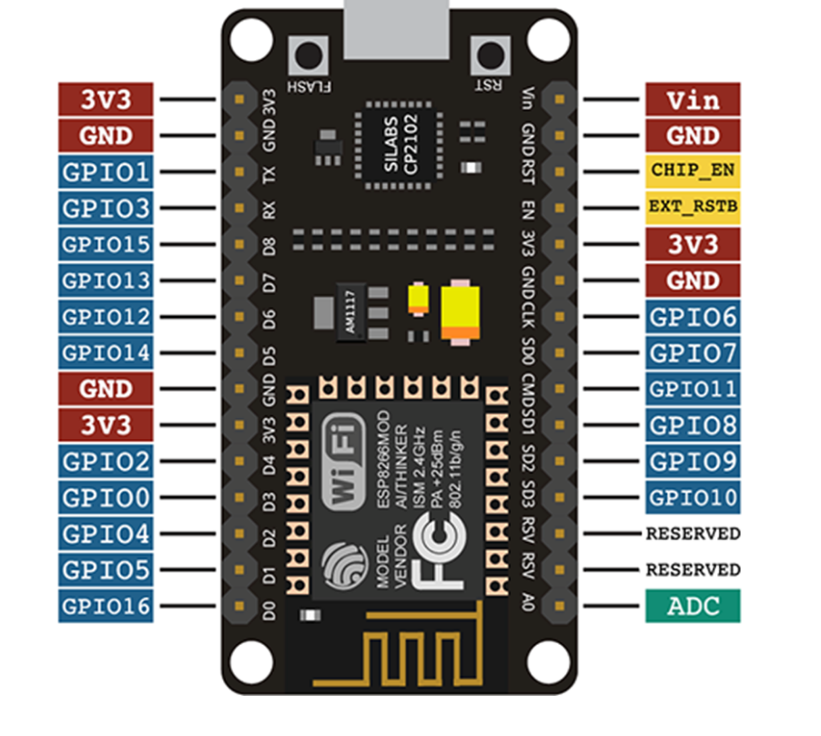

# Tools 

# ESP8266 PIN Layout
Le schéma suivant décris le mapping des ports de la carte à microprocesseur: 

# How to use a breadboard 

> Attention sur la breaboard que nous utilisons, les power lines (+) et (-) sont interrompues au centre de la planche.

