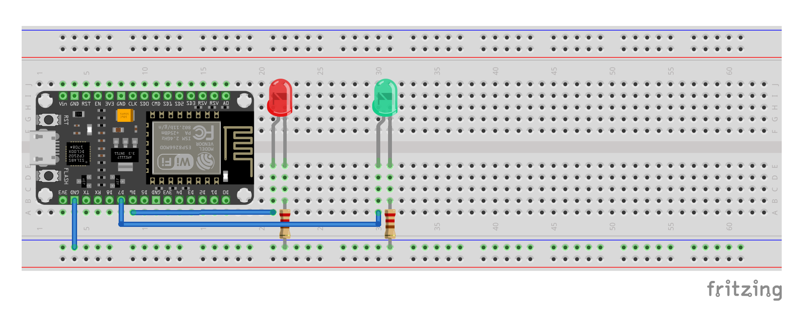
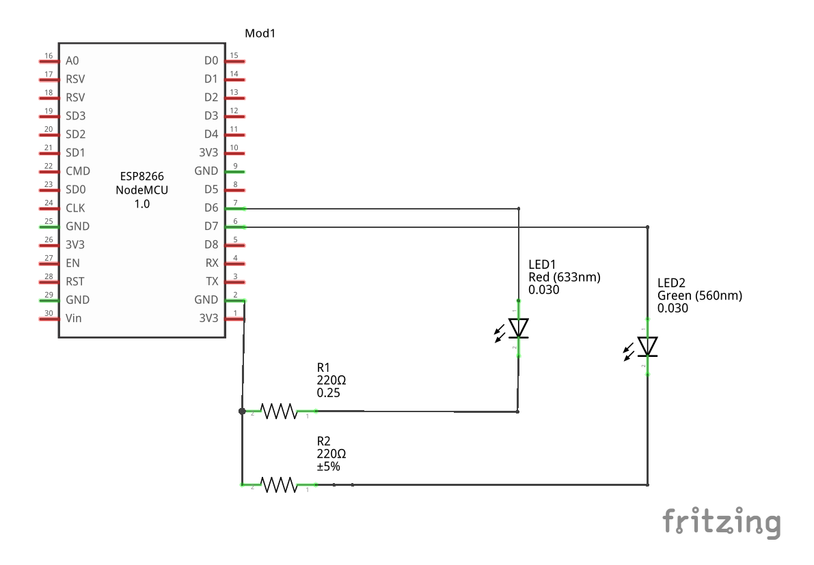

# Etape 1 : Faire clignoter les LEDS

## Objectifs 
Faire clignoter les deux leds (rouge et verte).

## Matériel nécéssaire
- [Carte NodeMCU Lua Amica Module V2](https://leony.ydayslyon.fr/consumables/284)
- [Breaboard](https://leony.ydayslyon.fr/consumables/291)
- [LED Rouge](https://leony.ydayslyon.fr/consumables/80)
- [LED Verte](https://leony.ydayslyon.fr/consumables/88)
- 2 x [Resistances 220](https://leony.ydayslyon.fr/consumables/104) 

## Schémas de branchement



## Extrait de code 

### Allumer et éteindre une LED
```c
int LED = 13;
void setup() {
  // Configurer le port LED en mode sortie. 
  pinMode(LED, OUTPUT);

}

void loop() {
  // Envoyer du courant dans le port LED. 
  digitalWrite(LED, HIGH);
  delay(500);

  // Ne plus envoyer de courant dans le port LED.
  digitalWrite(LED, LOW);
  delay(500);
}

```
