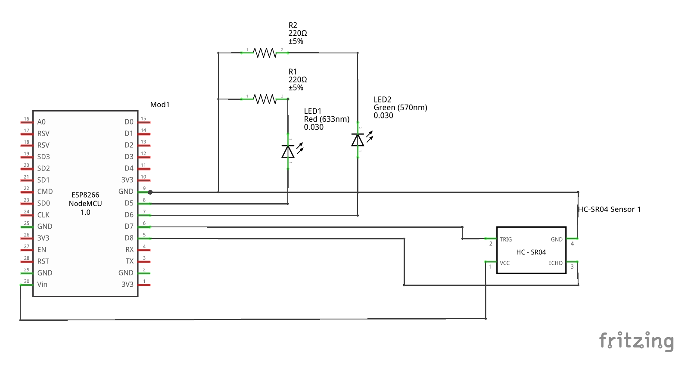

# Etape 2 : Ajouter le capteur de distance

## Objectifs
Utiliser un capteur de distance pour déterminer si la place de parking est occupée ou non et changer l'état des LED en fonction. 

Lorsque la place est occupée, on éclairera une LED de couleur rouge.   
Lorsque la place est libre, on éclairera une LED de couleur verte. 

## Matériel nécéssaire 
- [Capteur de distance ultrason](https://leony.ydayslyon.fr/consumables/159)

## Branchements



## Ressources 
[Fiche technique du capteur](https://cdn.sparkfun.com/datasheets/Sensors/Proximity/HCSR04.pdf)

## Extraits de code 
Lire la distance :
```c
float readDistanceCM() {
  digitalWrite(TRIG_PIN, LOW);
  delayMicroseconds(2);
  digitalWrite(TRIG_PIN, HIGH);
  delayMicroseconds(10);
  digitalWrite(TRIG_PIN, LOW);
  int duration = pulseIn(ECHO_PIN, HIGH);
  return duration * 0.034 / 2;
}
```
