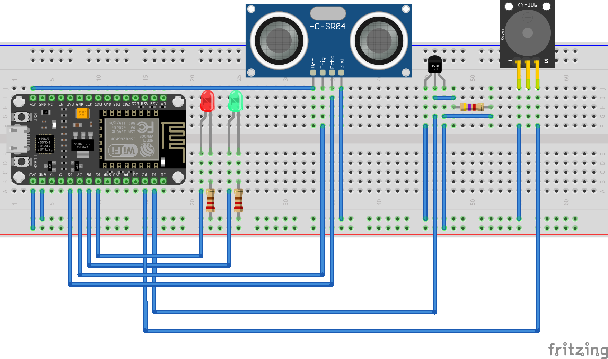
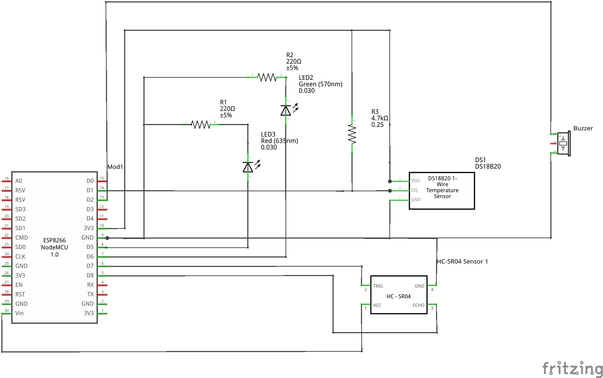

# Etape 5 : Ajouter le buzzer

## Objectif 
Lorsque la température dépasse un seuil prédéfini : émettre un son (alarme). 

## Matériel nécéssaire 
- Buzzer 

## Schémas de branchement 
Pas de schéma fournis à cette étape.

## Ressources 
- [Passive Buzzer Datasheet](https://www.electrokit.com/uploads/productfile/41015/Passive_Piezo_Buzzer.pdf)

## Branchements



## Extraits de code 
Emettre un son à une certaine fréquence (uniquement pour les buzzer passifs)

```c
tone(gpio, frequency);
```
