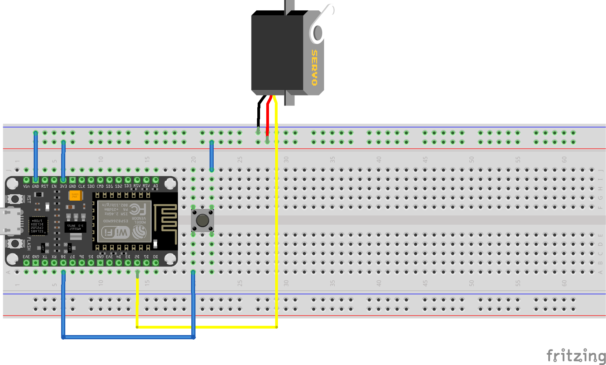
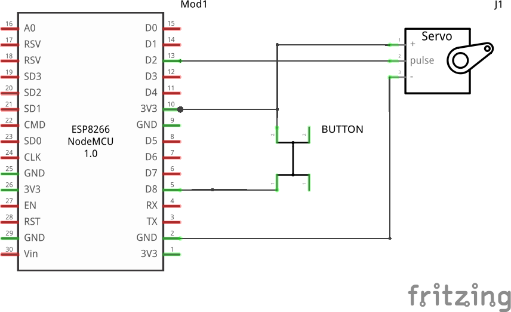

# Etape 1 : Ouvrir et fermer la barrière

## Objectifs 
Lorsque j'appuie sur le bouton, la barrière s'ouvre. 
Après un délai prédéfinie, elle se referme.

## Matériel nécéssaire
- [Carte NodeMCU Lua Amica Module V2](https://leony.ydayslyon.fr/consumables/284)
- [Moteur pas à pas](https://leony.ydayslyon.fr/consumables/146) + hélice. 
- [Bouton poussoir](https://leony.ydayslyon.fr/consumables/237)

## Ressources
- [Librairie Servo](https://www.arduino.cc/reference/en/libraries/servo/)

## Branchements




## Extraits de code 
Faire tourner le moteur Servo jusqu' à un certain angle. 
```c
#include <Servo.h>

Servo myservo;  // create servo object to control a servo

void setup() {
  myservo.attach(9);  // attaches the servo on pin 9 to the servo object
}

void loop() {
    myservo.write(90);              // tell servo to go to position 90°
}
```
